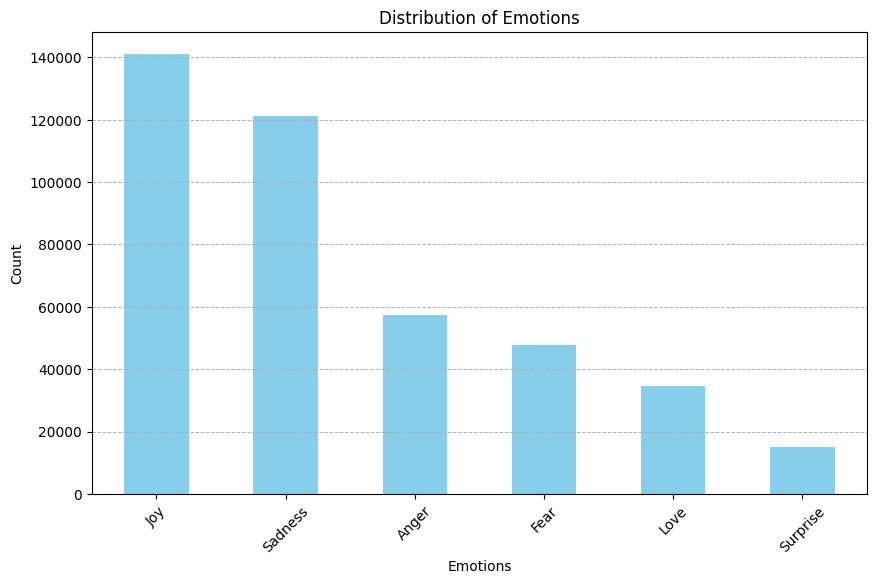

# Text-Emotion-Classification-NLP

## Overview
This repository presents a **comprehensive approach to emotion classification** on text data labeled with six emotions:
- **Sadness**
- **Joy**
- **Love**
- **Anger**
- **Fear**
- **Surprise**


We explore and compare four deep learning architectures, each in its own notebook:
1. **CNN (cnn.ipynb)**  
   - Embedding layer, convolutional filters, and global max pooling  
   - Achieves around 90% accuracy (depending on hyperparameters)

2. **LSTM (lstm.ipynb)**  
   - Incorporates LSTM units to capture sequential text patterns  
   - Dropout for regularization and optional RMSprop/Adam optimizers

3. **BiGRU (BiGRU.ipynb)**  
   - Bidirectional GRU capturing context in both directions  
   - Approx. 94% accuracy with extensive preprocessing (emoji handling, chat word cleanup)

4. **BERT (Bert.ipynb)**  
   - Fine-tunes a pre-trained BERT model  
   - Often yields the highest accuracy (~97%) but requires more computational resources

## Dataset
The dataset is sourced from:  
**“Emotion dataset.” Kaggle: NIDULA ELGIRIYEWITHANA. [https://www.kaggle.com/datasets/nelgiriyewithana/emotions](https://www.kaggle.com/datasets/nelgiriyewithana/emotions) (accessed Apr. 2, 2024).**

- Approximately **400,000** tweets labeled with one of the six emotions.  
- Preprocessing includes tokenization, stopword removal, padding, and optional class balancing.  
- Be sure to place or download the dataset into a `data/` folder as referenced by each notebook.

## Key Features
- **Data Preprocessing**: Includes removing emojis/chat words, balancing classes, tokenizing, and padding.  
- **Model Development**: Each notebook details training setup, hyperparameters (batch size, learning rate, epochs), and the chosen optimizer.  
- **Evaluation Metrics**: Accuracy, Precision, Recall, F1-score, Confusion Matrix, and sometimes ROC curves.  
- **Comparison**: Highlights how model complexity and architecture choice affect classification performance.

## Project Structure
```
.
├── cnn.ipynb           # CNN-based text classification
├── lstm.ipynb          # LSTM-based approach
├── BiGRU.ipynb         # Bidirectional GRU
├── Bert.ipynb          # BERT-based model
├── text                # Contains Kaggle Emotion dataset 
└── README.md           # Project documentation
```

## Installation & Setup
1. **Clone this repository**:
   ```bash
   git clone https://github.com/YourUsername/Text-Emotion-Classification-NLP.git
   cd Text-Emotion-Classification-NLP
   ```
2. **Obtain and place the Kaggle Emotion dataset**:
   - Download from [Kaggle: NIDULA ELGIRIYEWITHANA’s Emotion dataset](https://www.kaggle.com/datasets/nelgiriyewithana/emotions).

## Usage
1. **Launch Jupyter Notebook** (or JupyterLab):
   ```bash
   jupyter notebook
   ```
2. **Open any of the notebooks** (e.g., `cnn.ipynb`, `lstm.ipynb`, etc.):
   - Run the cells in order to load data, build the model, and evaluate results.
   - Each notebook details its own architecture and training routine.

3. **Compare Results**:
   - Look at accuracy, F1 scores, and confusion matrices to see how CNN, LSTM, BiGRU, and BERT differ in performance.

## Results
- **CNN**: About 90% accuracy, excels at extracting local features from text.  
- **LSTM**: Captures long-term context, around the low- to mid-90s accuracy.  
- **BiGRU**: Often surpasses LSTM in capturing bidirectional context, ~94% accuracy.  
- **BERT**: Typically the best performer (~97% accuracy), though more computationally intensive.

## License
This project is licensed under the [MIT License](LICENSE).
